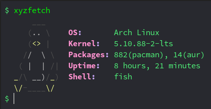

# xyzfetch
simplest and lightest system information display tool for arch &amp; arch-based OS written in bash

Replacement for neofetch or rxfetch or other system display utility cause they are bloated for a minimalstic arch user.

### Usage
- get [xyzfetch](xyzfetch) in your arch or arch based system make it executable place it in path and execute it from anywhere.
```
git clone https://github.com/whoisYoges/xyzfetch.git
cd xyzfetch
chmod +x xyzfetch
sudo cp xyzfetch /usr/local/bin/
```
### Preview of xyzfetch


